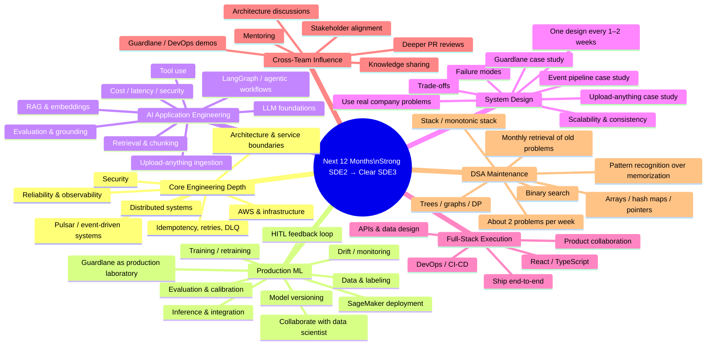

# SDE3 Depth Roadmap — Sep 2026 → Sep 2027

> **Real work. Real depth. Real impact.**
>
> Don't prepare to *look* like an SDE3 in an interview. Spend the year becoming difficult to interview below SDE3.

## Context

With roughly another year of runway at the current company, the priority shifts away from short-term interview grinding toward building durable engineering depth using real production work.

A particularly useful signal: after discussing production ML deployment with a company data scientist, it appears production ML deployment experience is relatively rare internally. Guardlane therefore becomes more than a completed feature — it is a foundation for building deeper ML/platform expertise.

The upcoming upload-anything/chatbot work can add a second dimension: LLM application engineering and potentially LangGraph/agentic workflows.

## Mind Map

## Priority Model

| Area | Approx. learning emphasis | Purpose |
|---|---:|---|
| Core engineering / distributed systems | 35–40% | Build the technical depth expected at SDE3+ |
| Production ML | 20–25% | Turn rare production experience into genuine specialization |
| AI application engineering | 15–20% | Add RAG, LangGraph, agentic and LLM production skills |
| System design | 15% | Convert implementation experience into architectural reasoning |
| DSA | 5–10% | Stay interview-ready without making LeetCode the curriculum |

Full-stack delivery and leadership are primarily developed through normal project execution rather than treated as separate study tracks.

## DSA Rule

Grind 75 moves into **maintenance mode**.

Do not memorize individual solutions. Preserve recognition patterns and reconstruction ability.

Examples:

- next future element satisfying a condition → consider monotonic stack
- contiguous range + target → consider prefix sum / hash map
- ordered search space with eliminable halves → binary search
- overlapping intervals → sort + merge/sweep

Routine: roughly two problems per week, with periodic blind retrieval of older problems.

## Production ML Depth Loop

Use Guardlane to understand the complete lifecycle rather than stopping at deployment:

`data → labeling → training → evaluation → versioning → deployment → inference → telemetry → errors/drift → HITL → new labels → retraining`

Study where the current system is mature, where it is intentionally simple, and where a production ML platform would require additional capabilities.

## Chatbot / LangGraph Rule

Do **not** begin with the framework.

Reason in this order:

`requirements → constraints → architecture → failure modes → trade-offs → technology`

For upload-anything, investigate questions such as:

- accepted document types and sizes
- synchronous vs asynchronous ingestion
- extraction pipeline
- security and malware boundary
- tenant isolation
- document lifecycle / deletion
- chunking and indexing
- authorization inheritance
- retrieval quality
- grounding and citations
- evaluation
- cost and latency
- observability

Only then decide where LangGraph, RAG, vector stores, queues, workflows, or simpler components belong.

## 12-Month Outcome

By the end of this runway, aim to have evidence of:

- deep backend/distributed-systems reasoning
- genuine production ML lifecycle knowledge
- production LLM / LangGraph skills
- several documented system-design case studies from real work
- stronger PR and architectural reviews
- cross-team technical influence
- continued full-stack execution
- DSA pattern fluency without grind dependency

The target is not a larger list of technologies. It is a smaller set of capabilities understood deeply enough to **design, build, explain, review, operate, and teach**.
