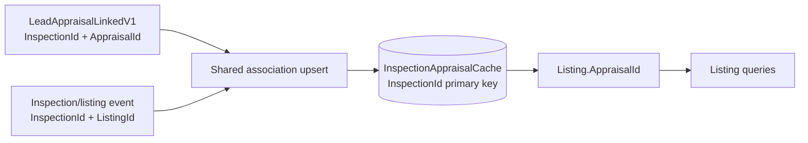

# Seller-service appraisal association under concurrent events

## Evidence

- Source: internal seller-service implementation
- Evidence: merged production change and focused test coverage
- Completed: September 2026
- Collaboration: design and review discussion with a senior engineer from
  another team

This was a relatively small product change, but it introduced a distributed
state-convergence problem: two independent events can arrive in either order
and both may update the same logical association.

## Problem

Seller-service needs to associate an appraisal with a listing without making a
runtime Leads lookup on every read. The required relationship is identified by
`InspectionId`, but the two sides become known through different event flows:

1. `LeadAppraisalLinkedV1` supplies `InspectionId` and `AppraisalId`.
2. Inspection/listing events supply `InspectionId` and `ListingId`.

Either event can arrive first. Events can also be redelivered, and an existing
listing can be recreated or replaced while retaining the inspection
relationship.

## State model

The implementation uses an inspection-keyed cache as the convergence point:

```text
InspectionAppraisalCache
  InspectionId  primary key
  ListingId     nullable
  AppraisalId   nullable
```

`Listing.AppraisalId` is a denormalized read field used by listing queries.
The cache retains partial knowledge until both sides are available, then the
listing projection is updated.



## Concurrency invariant

For a given `InspectionId`, the association update must converge to the union
of the known values rather than allowing one event to erase the other:

```text
cache.ListingId  = latest valid ListingId, if known
cache.AppraisalId = latest valid AppraisalId, if known
```

The update for one event must preserve the sibling field already stored by the
other event. A replay must not create a second cache row or regress an already
correct listing/appraisal association.

The stronger relationship invariant is:

```text
Listing.AppraisalId = cache.AppraisalId
only when cache.ListingId = Listing.Id
and Listing.InspectionId = cache.InspectionId
```

This prevents a late or stale event from attaching an appraisal to a listing
that no longer belongs to the inspection.

## How the implementation protects the invariant

The shared `InspectionAppraisalAssociationService`:

- uses `InspectionId` as the cache primary key;
- runs the mutation inside an existing transaction when one exists, otherwise
  creates a transaction;
- locks the cache row and relevant listing row with `FOR UPDATE`;
- reloads tracked entities before mutation;
- changes only the fields supplied by the current event;
- validates that a supplied listing still belongs to the inspection;
- handles previous listing associations when a listing is replaced;
- updates `Listing.AppraisalId` only after both identifiers are available;
- avoids unnecessary writes when the listing already has the correct value.

This is not merely an upsert. It is a serialized read-modify-write operation
with relationship validation and projection repair.

## Event-order analysis

| Event order | Intermediate state | Final state |
|---|---|---|
| Appraisal link first | `InspectionId + AppraisalId` | Later listing event adds `ListingId` and updates the listing projection |
| Listing event first | `InspectionId + ListingId` | Later appraisal event adds `AppraisalId` and updates the listing projection |
| Redelivery | Existing complete or partial row | Idempotent convergence; no duplicate cache row |
| Listing recreation | Cache points to inspection and appraisal | Association is reassigned to the valid replacement listing |
| Stock replacement | Same inspection/appraisal relationship | Projection remains associated with the correct listing |
| Stale listing event | Listing no longer belongs to inspection | Update is rejected or does not attach the appraisal |

## Verification evidence

The merged change records:

- integration project build with zero errors;
- 100 focused processor/search validations passed;
- 114 listing client tests passed;
- inventory-filter compatibility test passed;
- `git diff --check` passed.

The change also added or updated coverage for cache persistence, event ordering,
redelivery/idempotency, listing recreation, stock-id changes, and listing
filter compatibility.

## SDE3 depth demonstrated

This change provides evidence of:

- recognizing that independent event consumers create a concurrency problem;
- choosing a state model that supports partial information and eventual
  convergence;
- defining invariants before choosing implementation details;
- protecting a read-modify-write operation with database transaction and row
  locking semantics;
- preserving compatibility while adding a new filter contract;
- reasoning about stale, duplicated, out-of-order, and replacement events;
- collaborating across team boundaries on a production change;
- communicating the behavior through a PR description, diagrams, tests, and
  explicit review paths.

## Verified delivery and recovery behavior

- Pulsar subscriptions use `KeyShared`.
- Delivery is at least once; redelivery is possible.
- Ordering is expected only per Pulsar key, assuming publishers use the same
  inspection key. There is no global ordering across the three event topics.
- Consumers retry up to seven times with backoff up to ten minutes.
- The association transaction locks the cache row by `InspectionId`, then the
  listing row, using a consistent order to reduce deadlock risk.
- The local mutation policy retries `DbUpdateConcurrencyException` twice.
- There is no dedicated deadlock retry in this change; an escaped exception relies
  on Pulsar redelivery.

## Partial state and missing-event behavior

Partial cache state is intentional:

- appraisal first: `AppraisalId` populated, `ListingId` null;
- listing first: `ListingId` populated, `AppraisalId` null.

There is no automatic reconciliation job or unresolved-state metric in this
PR. Partial rows can be identified with:

```sql
SELECT *
FROM inspection_appraisal_caches
WHERE listing_id IS NULL
   OR appraisal_id IS NULL;
```

If the missing event never arrives, the cache remains partial and the listing
does not receive `Listing.AppraisalId`; it therefore does not appear in
`inventoryFilter=Appraisal`. Once Pulsar retries are exhausted, this change has no
dedicated DLQ consumer or backfill process. Recovery requires event replay or
a future reconciliation/backfill mechanism.

## Appraisal changes and stale events

`AppraisalId` can change when a later appraisal event supplies a new non-null
value. Locking and reloading, inspection validation, and previous-listing
cleanup prevent a cross-inspection stale event from attaching an old appraisal
to the wrong listing.

There is no event-version comparison for conflicting appraisal events belonging
to the same inspection. If different appraisal IDs are received for one
inspection, the final processed event wins.

## Production evidence gap

The merged change has integration coverage for both event orders, replacement
listing cleanup, stale inspection/listing events, duplicate resolution, and
projection into listing responses.

It does not add production convergence metrics, reconciliation dashboards, or
an unresolved-cache alert. Production confirmation would require checking
Pulsar redelivery/retry counts, consumer errors, partial cache rows, populated
listing appraisal IDs, and agreement between cache and listing projections.

Therefore the implementation is retry-safe and idempotent for the covered
event races, but convergence depends on eventual event delivery and has no
automated repair path for permanently missing events.

## Communication version

The concise explanation for a design review is:

> Two independent event streams provide different halves of one relationship.
> Because either can arrive first or be redelivered, we keyed a partial cache
> by `InspectionId` and made the association update a transactional,
> row-serialized read-modify-write. Each event contributes only the field it
> owns; once both identifiers are present, the listing projection is repaired.
> Tests cover ordering, replay, replacement, and compatibility. Pulsar
> redelivery handles escaped failures, while the remaining operational gap is
> the absence of an automated repair path and production alert for permanently
> partial state.
